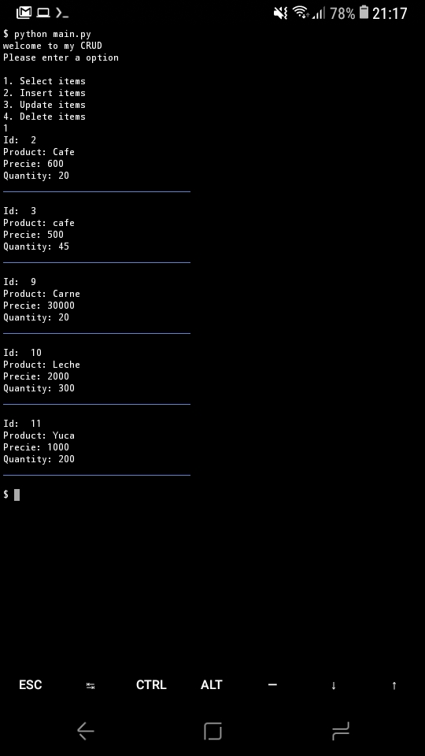

#Crud python

Un crud creado con python oara ejecutar en consola.

##Database

Para poder ejecutar esta aplicaccion por favor ingrese a su gestor de base d
e datos e importe el archivo producto.sql que se encuentra en la carpeta sql

###Screenshot

